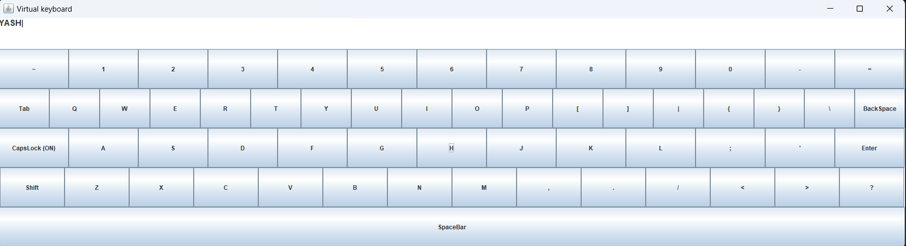

# Virtual_Keyboard_in_swing
Virtual_Keyboard_Demo made using swing in java

## Overview

The Java Virtual Keyboard with Swing is a graphical user interface application that simulates a virtual keyboard. This project is built using Java Swing to provide a simple and interactive way to input characters.

### Features

- Virtual keyboard layout with standard QWERTY keys.
- Clickable buttons for each key.
- Supports basic keyboard functionalities.

## Demo

Check out the [video demo](res/demo1.mp4) to see the virtual keyboard 

## Installation

1. Clone or download the repository.
2. Open the project in your favorite Java IDE.
3. Build and run the application.

## Usage

- Launch the application, and the virtual keyboard GUI will appear.
- Click on the virtual keys with your mouse to input characters.
- Use the virtual keyboard as an alternative input method.

## Contributing

If you'd like to contribute to the development of this virtual keyboard, please follow these steps:

1. Fork the repository.
2. Create a new branch for your feature or bug fix: `git checkout -b feature/my-feature` or `git checkout -b bugfix/my-bug-fix`.
3. Make your changes and commit them: `git commit -m "Description of changes"`.
4. Push to your fork: `git push origin feature/my-feature`.
5. Create a pull request.
